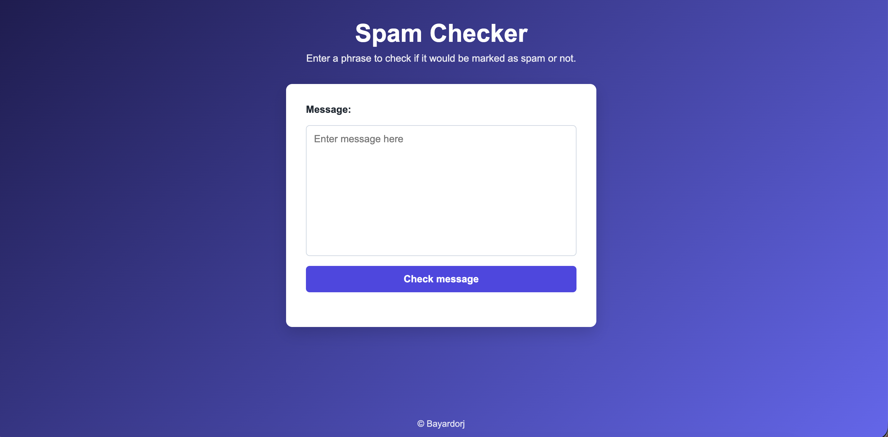

# Spam-checker
 
 
 

---

## 🌟 Features

Coming soon

---

## 🌐 Live Demo

Try it live:  
[https://bayardorj.github.io/Spam-checker/](https://bayardorj.github.io/Password-generator/)

---

## 🖼 Preview

  

---

## 🛠 Technologies Used

- HTML5  
- CSS3  
- JavaScript (ES6)  
- Git & GitHub Pages  

---
